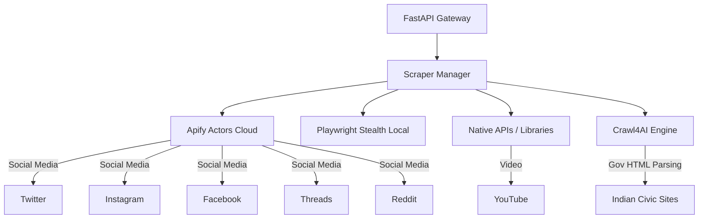

# Scrapify Labs v2 🚀

A highly scalable, dual-engine web scraping microservice built for **Indian Public Portals & Governance Analysis**. 

Scrapify v2 leverages a resilient 3-tier fallback architecture capable of fetching raw civic data and social media complaints at scale—running entirely on **$0 base cost**.

---

## 🏗️ Architecture



### The 3-Tier Priority System
Our orchestrator automatically routes requests to the most stable, cost-effective engine:
1. **Priority 1: Apify SDK** — Cloud-based, rotating proxy actors that effortlessly bypass Twitter/Meta anti-bot walls. (Used if `APIFY_API_TOKEN` is set).
2. **Priority 2: Playwright Stealth** — Local headless Chromium browser injecting your personal authentication cookies (fallback for social media).
3. **Priority 3: Native / Libraries** — Fallback to direct APIs (PRAW for Reddit, API v3 for YouTube, or `twscrape`).

### Crawl4AI ✨
For unstructured, often-breaking Indian government websites (e.g., `data.gov.in`), we built native open-source headless browser extraction using **Crawl4AI**. It extracts main content without needing complex CSS selectors.

---

## 📋 Configured Platforms
- ✅ **Twitter** (Apify / Playwright)
- ✅ **Instagram** (Apify / Playwright)
- ✅ **Facebook** (Apify / Crawl4AI)
- ✅ **Threads** (Apify / Crawl4AI)
- ✅ **Reddit** (Apify / PRAW)
- ✅ **YouTube** (Data API v3)
- ✅ **Civic** (Crawl4AI — `data.gov.in`, `Smart Cities`, etc.)

---

## 🚀 Getting Started

### 1. Installation
```bash
git clone <repo-url>
cd Scrapify
python3 -m venv .venv
source .venv/bin/activate
pip install -r requirements.txt
```

### 2. Environment Variables
Copy the template and fill in your keys:
```bash
cp .env.example .env
```

**Crucial Key for v2 Scale:**
* `APIFY_API_TOKEN`: Get a free token at [Apify](https://console.apify.com/). The $5/mo free tier handles ~20,000 requests. Without this, Facebook and Threads will not work, and Twitter/Instagram will fall back to your fragile local cookies.

### 3. Run the Server
```bash
uvicorn src.main:app --port 8000 --reload
```
Access the Swagger UI at: `http://localhost:8000/docs`

---

## 📊 API Usage

**POST `/api/scrape`**
Trigger a scraping job across multiple platforms simultaneously.
```json
{
  "keywords": ["pothole", "water supply"],
  "platforms": ["twitter", "civic", "youtube"],
  "max_results": 10
}
```

**GET `/api/results`**
Retrieve normalized records from the local SQLite database.
```bash
curl "http://localhost:8000/api/results?platform=civic&page_size=5"
```

---

## 💰 Cost Analysis
* **Crawl4AI (Civic Sites):** $0 (Open-source, local)
* **YouTube/Reddit APIs:** $0 (Free tiers)
* **Apify (Social Media):** $0 Base ($5 free tier = ~20k posts). Scales infinitely for pennies per thousand posts.

---
*Built for Developer-Devanshhh/Scrapify-Labs*
