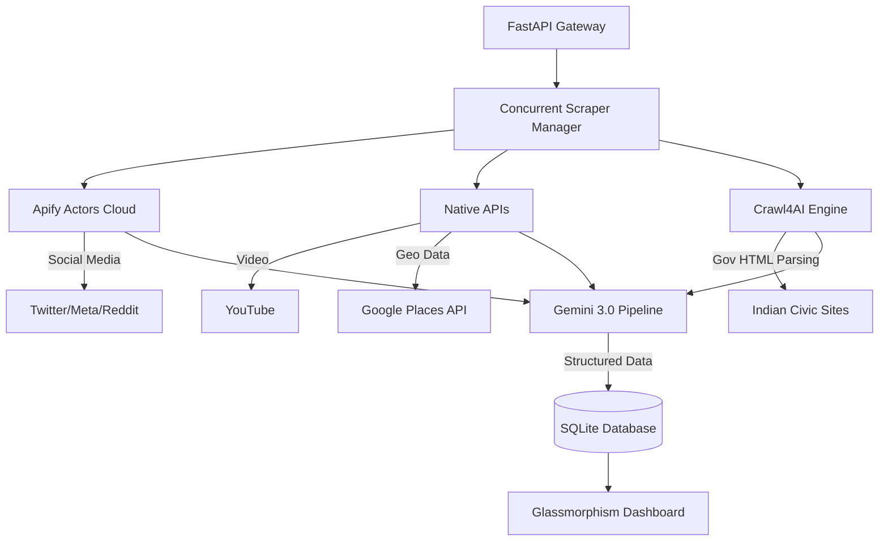

# Scrapify Labs v3 🚀

A highly scalable, AI-powered web scraping microservice built for **Indian Local Governance Intelligence**. 

Scrapify v3 upgrades the core scraper into a **geo-aware intelligence engine** that automatically categorizes citizen complaints, extracts coordinates, and summarizes issues using **Google Gemini 3.0 Flash**, running with maximum concurrency for minimal latency.


---

## ✨ New in v3: Governance Intelligence

1. **🧠 AI Structuring (Gemini 3.0 Flash)**
   Raw social media posts and civic grievances are automatically piped through Gemini to extract: `Category` (e.g. Infrastructure), `Urgency` (Critical/High), `Sentiment`, and structured summaries.
   
2. **📍 Geo-Tagging & Google Maps**
   Added a dedicated **Google Places API** scraper that pulls reviews from local municipal offices, hospitals, and parks, injecting hard GPS `latitude`/`longitude` coordinates into the database.
   
3. **⚡ Concurrent Orchestrator (`asyncio.gather`)**
   Scrapers no longer run one-by-one. A 7-platform intelligence sweep now completes in ~15 seconds instead of 60+ seconds.
   
4. **🏙️ City-Scoped Demo Mode**
   Set `DEMO_CITY=Chennai` in your `.env` and all scrapers automatically refine their searches (e.g. converting "pothole" to "pothole Chennai") to drastically reduce noise.
   
5. **🎨 Premium Frontend UI**
   A built-in glassmorphism dashboard (served natively from `/public`) to trigger scrapes, filter by platform, and view AI-enriched results with color-coded badges.

---

## 🏗️ Architecture



### The Scraper Hierarchy
1. **Google Maps (Places API)**: Unmatched hyper-local reviews.
2. **Crawl4AI Engine**: Headless extraction of unstructured Indian `.gov.in` sites (MyGov, India Environment Portal).
3. **Apify Cloud**: Free-tier rotating proxy actors to bypass social media walls without getting IP banned.
4. **Native Fallbacks**: Playwright stealth mode and library wrappers (`twscrape`, PRAW).

---

## 📋 Configured Platforms
- ✅ **Google Maps** (Places API)
- ✅ **Civic** (Crawl4AI — `data.gov.in`, `SBM`, etc.)
- ✅ **Twitter** (Apify / Playwright)
- ✅ **Instagram** (Apify / Playwright)
- ✅ **Facebook** (Apify)
- ✅ **Threads** (Apify)
- ✅ **Reddit** (Apify / PRAW)
- ✅ **YouTube** (Data API v3)

---

## 🚀 Getting Started

### 1. Installation
```bash
git clone <repo-url>
cd Scrapify
python3 -m venv .venv
source .venv/bin/activate
pip install -r requirements.txt
```

### 2. Environment Variables
Copy the template and fill in your keys:
```bash
cp .env.example .env
```

**Crucial v3 Keys:**
* `GEMINI_API_KEY`: For AI structuring (free from AI Studio).
* `GOOGLE_MAPS_API_KEY`: For Places API reviews.
* `APIFY_API_TOKEN`: $5/mo free tier handles ~20k social media requests completely bypassing bot-walls.
* `DEMO_CITY`: Set to "Chennai", "Delhi", etc., to scope the orchestrator.

### 3. Run the Server
```bash
uvicorn src.main:app --port 8000 --reload
```
- Access the UI Dashboard: `http://localhost:8000/`
- Access the Swagger API: `http://localhost:8000/docs`

---

## 📊 API Example

Trigger a scraping job:
```bash
curl -X POST "http://localhost:8000/api/scrape" \
     -H "Content-Type: application/json" \
     -d '{"keywords": ["pothole"], "platforms": ["google_maps", "civic", "twitter"], "max_results": 5}'
```

---

## 💰 Cost Analysis
* **Crawl4AI (Civic Sites):** $0 (Open-source, local)
* **Google Gemini 3.0 Flash:** $0 (Free tier, 15 RPM)
* **Google Maps API:** Covered completely by monthly free credits.
* **Apify (Social Media):** $0 Base ($5 free tier = ~20k posts). 

---
